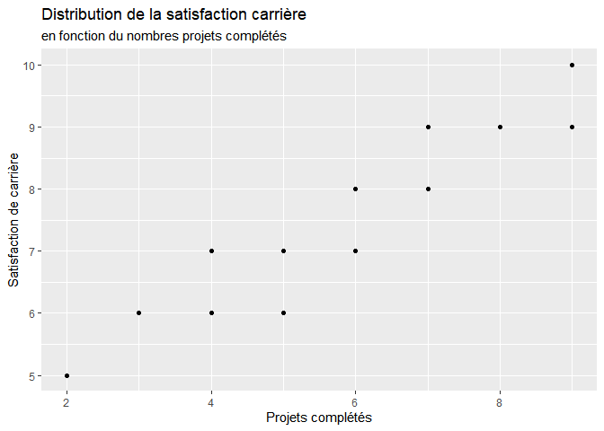
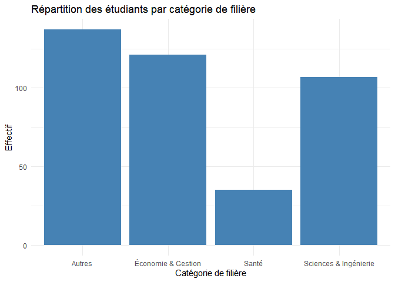
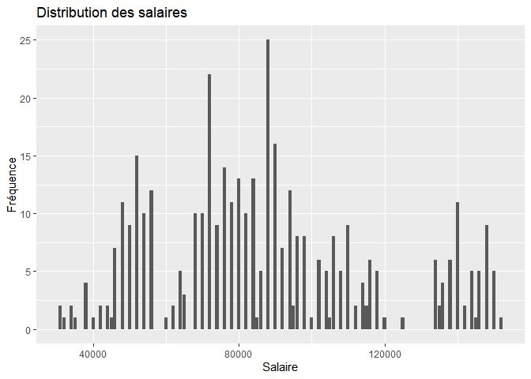
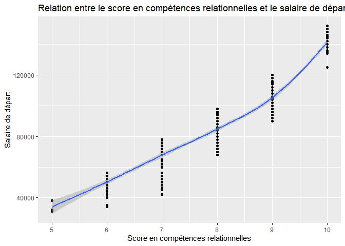

Proposition de projet
================
Marie-Anne Randrianarivony,Fatoumata Binta Diallo,salem asani, N’GUESSAN
WILFRIED ARMEL
2025-12-15

``` r
library(tidyverse)
library(broom)
library(dplyr)
library(skimr)
library(tidymodels)
data <-read_csv("C:/Users/Wilfried/Desktop/INTRO science  des données/Projet-Groupe-4/education_career_success.csv")
```

## 1. Introduction

Nous voulions choisir ce jeu de donnée étant nous même étudiant, nous
voulons savoir concrètement quels facteurs dans le domaine de
l’éducation influencent la réussite d’une carrière future. Ce qui nous a
permis de poser la question suivante: Dans quelle mesure les
caractéristiques éducatives et personnelles influencent-elles la
réussite professionnelle ?

Pour y répondre, nous poserons comme objectif de :

- Comprendre l’effet de l’éducation scolaire

- Mesurer l’impact de l’expérience pratique (stages, certificats)

- Examiner l’influence des compétences relationnelles

- Mesurer les différences selon le genre ou le niveau de carrière

***Méthode de collecte:*** Le jeu de données “Education Career Success”
provient du site web Kaggle
(<https://www.kaggle.com/datasets/adilshamim8/education-and-career-success>),
publié par Adil Shamim. Le jeu de donnée a été collecté à partir de
plusieurs sources validées au cours d’une étude longitudinale menée
auprès de jeunes diplômés universitaires (promotions 2018-2022).

***Nombre d’observations et de variables:*** Dans ce jeu de donnée, nous
avons **400** observations provenant des étudiants anonymes d’une
université et **19** variables.

Les 19 variables sont:

**Student_ID:** le code alphanumérique unique attribué à chaque
étudiant.

**Age:** l’âge de l’ étudiant en années entières, au moment de
l’obtention du diplôme ou de la collecte des données.

**Gender:** l’identité sexuelle déclarée par l’individu peut-être:
“Homme”,“Femme”,ou “Autre”.

**High_School_GPA:** la moyenne cumulative des notes obtenues au lycée
sur une échelle de 2.0 à 4.0.

**SAT_Score:** le score total à l’examen d’entrée à l’université SAT,
compris entre 900 et 1600.

**University_GPA:** la moyenne cumulative des notes obtenues au premier
cycle universitaire sur une échelle de 2.0 à 4.0.

**Field_of_Study:** la spécialité ou la discipline universitaire
(exemple: “informatique”, “médecine”, “commerce”).

**Internship_Completed:** le nombre de stages officiels effectués
pendant les études universitaires (peu être une valeur de 0 à 4).

**Projects_Completed:** le nombre de projets universitaires ou
personnels importants (exemple: projet de fin d’études, de recherches,
applications) menés à bien (0 à 9).

**Certifications:** le nombre de certificats reconnus par l’industrie
(exemple: AWS,PMP) obtenus en dehors des cours officiels (0 à 5).

**Soft_Skills_Score:** l’évaluation par un enseignant ou un pair des
compétences en communication, en travail d’équipes et en leadership, sur
une échelle de 1 à 10.

**Networking_Score:** l’évaluation quantitative de réseautage
professionnel (exemple: connexions LinkedIn, évènements auxquels
l’étudiant a participé) sur une échelle de 1 à 10.

**Job_Offers:** le nombre total d’offres d’emplois à temps plein
distinctes reçues dans les 6 mois suivant l’obtention du diplôme (0 à
5).

**Starting_Salary:** le salaire annuel de base en dollars américains
pour le premier emploi à temps plein (25 000 et 150 000 dollars).

**Career_Satisfaction:** la satisfaction déclarée par les répondants à
l’égard de leur premier emploi, sur une échelle de 1(très insatisfait) à
10(très satisfait).

**Years_to_Promotion:** le nombre d’années écoulées entre la date
d’embauche et la promotion au niveau professionnel supérieur (1 à 5).

**Current_Job_Level:** le stade de carrière catégoriel au moment de la
collecte des données: “Débutant”,“Senior” ou “Cadre”.

**Work_Life_Balance:** l’équilibre auto-évalué entre vie professionnelle
et vie privée, notée de 1(mauvais) à 10(excellent).

**Entrepreneurship:** indique si la personne a fondé ou cofondé une
entreprise (“Oui” ou “Non”).

## 2. Données

``` r
glimpse(data)
```

    ## Rows: 400
    ## Columns: 19
    ## $ Student_ID            <chr> "S001", "S002", "S003", "S004", "S005", "S006", …
    ## $ Age                   <dbl> 22, 24, 21, 23, 25, 22, 24, 23, 21, 25, 22, 24, …
    ## $ Gender                <chr> "Male", "Female", "Male", "Female", "Male", "Fem…
    ## $ High_School_GPA       <dbl> 3.8, 3.6, 3.9, 3.5, 3.7, 3.4, 3.2, 3.8, 3.6, 3.9…
    ## $ SAT_Score             <dbl> 1450, 1380, 1520, 1300, 1420, 1250, 1180, 1480, …
    ## $ University_GPA        <dbl> 3.6, 3.4, 3.8, 3.2, 3.5, 3.1, 2.9, 3.7, 3.3, 3.9…
    ## $ Field_of_Study        <chr> "Computer Science", "Business", "Engineering", "…
    ## $ Internships_Completed <dbl> 3, 2, 4, 1, 2, 1, 0, 3, 2, 4, 1, 2, 2, 3, 3, 1, …
    ## $ Projects_Completed    <dbl> 7, 5, 9, 3, 6, 4, 2, 8, 5, 9, 3, 6, 5, 7, 6, 4, …
    ## $ Certifications        <dbl> 2, 3, 4, 1, 2, 1, 0, 3, 2, 5, 1, 2, 2, 3, 3, 1, …
    ## $ Soft_Skills_Score     <dbl> 8, 7, 9, 6, 8, 7, 6, 9, 7, 10, 6, 8, 7, 9, 8, 7,…
    ## $ Networking_Score      <dbl> 7, 6, 8, 5, 7, 6, 4, 8, 7, 9, 5, 7, 6, 8, 7, 6, …
    ## $ Job_Offers            <dbl> 3, 2, 4, 1, 3, 1, 0, 3, 2, 5, 1, 2, 2, 3, 3, 1, …
    ## $ Starting_Salary       <dbl> 85000, 65000, 120000, 48000, 95000, 42000, 35000…
    ## $ Career_Satisfaction   <dbl> 8, 7, 9, 6, 8, 7, 5, 9, 7, 10, 6, 7, 7, 8, 8, 6,…
    ## $ Years_to_Promotion    <dbl> 2, 3, 1, 4, 2, 5, 5, 2, 3, 1, 4, 3, 4, 2, 3, 5, …
    ## $ Current_Job_Level     <chr> "Mid", "Mid", "Senior", "Entry", "Mid", "Entry",…
    ## $ Work_Life_Balance     <dbl> 7, 6, 6, 8, 5, 9, 7, 6, 6, 5, 8, 7, 6, 7, 6, 8, …
    ## $ Entrepreneurship      <chr> "No", "No", "No", "No", "No", "No", "No", "No", …

``` r
skim(data)
```

|                                                  |      |
|:-------------------------------------------------|:-----|
| Name                                             | data |
| Number of rows                                   | 400  |
| Number of columns                                | 19   |
| \_\_\_\_\_\_\_\_\_\_\_\_\_\_\_\_\_\_\_\_\_\_\_   |      |
| Column type frequency:                           |      |
| character                                        | 5    |
| numeric                                          | 14   |
| \_\_\_\_\_\_\_\_\_\_\_\_\_\_\_\_\_\_\_\_\_\_\_\_ |      |
| Group variables                                  | None |

Data summary

**Variable type: character**

| skim_variable     | n_missing | complete_rate | min | max | empty | n_unique | whitespace |
|:------------------|----------:|--------------:|----:|----:|------:|---------:|-----------:|
| Student_ID        |         0 |             1 |   4 |   4 |     0 |      400 |          0 |
| Gender            |         0 |             1 |   4 |   6 |     0 |        2 |          0 |
| Field_of_Study    |         0 |             1 |   3 |  16 |     0 |       11 |          0 |
| Current_Job_Level |         0 |             1 |   3 |   6 |     0 |        3 |          0 |
| Entrepreneurship  |         0 |             1 |   2 |   2 |     0 |        1 |          0 |

**Variable type: numeric**

| skim_variable | n_missing | complete_rate | mean | sd | p0 | p25 | p50 | p75 | p100 | hist |
|:---|---:|---:|---:|---:|---:|---:|---:|---:|---:|:---|
| Age | 0 | 1 | 23.00 | 1.42 | 21.0 | 22.0 | 23.00 | 24.0 | 25.0 | ▇▇▇▇▇ |
| High_School_GPA | 0 | 1 | 3.62 | 0.19 | 3.2 | 3.5 | 3.60 | 3.8 | 3.9 | ▂▃▇▃▇ |
| SAT_Score | 0 | 1 | 1388.60 | 114.31 | 1160.0 | 1300.0 | 1380.00 | 1480.0 | 1580.0 | ▅▇▇▆▇ |
| University_GPA | 0 | 1 | 3.44 | 0.29 | 2.8 | 3.2 | 3.45 | 3.7 | 4.0 | ▂▃▇▃▃ |
| Internships_Completed | 0 | 1 | 2.50 | 1.06 | 0.0 | 2.0 | 3.00 | 3.0 | 4.0 | ▁▅▆▇▅ |
| Projects_Completed | 0 | 1 | 6.24 | 1.90 | 2.0 | 5.0 | 6.00 | 8.0 | 9.0 | ▂▂▇▅▇ |
| Certifications | 0 | 1 | 2.62 | 1.27 | 0.0 | 2.0 | 3.00 | 3.0 | 5.0 | ▅▆▇▂▃ |
| Soft_Skills_Score | 0 | 1 | 7.93 | 1.31 | 5.0 | 7.0 | 8.00 | 9.0 | 10.0 | ▅▆▇▆▅ |
| Networking_Score | 0 | 1 | 6.93 | 1.32 | 4.0 | 6.0 | 7.00 | 8.0 | 9.0 | ▅▆▇▆▅ |
| Job_Offers | 0 | 1 | 2.74 | 1.36 | 0.0 | 2.0 | 3.00 | 4.0 | 5.0 | ▆▇▇▅▅ |
| Starting_Salary | 0 | 1 | 87562.50 | 29685.42 | 31000.0 | 68000.0 | 84000.00 | 105250.0 | 152000.0 | ▅▆▇▃▃ |
| Career_Satisfaction | 0 | 1 | 7.79 | 1.37 | 5.0 | 7.0 | 8.00 | 9.0 | 10.0 | ▆▇▇▆▅ |
| Years_to_Promotion | 0 | 1 | 2.92 | 1.34 | 1.0 | 2.0 | 3.00 | 4.0 | 5.0 | ▃▇▆▃▅ |
| Work_Life_Balance | 0 | 1 | 6.41 | 0.93 | 5.0 | 6.0 | 6.00 | 7.0 | 9.0 | ▂▇▅▃▁ |

## 3. Résultats attendus

Nous anticipons que : - la satisfaction de carrière tend à augmenter
avec le nombre de stages complétés; - la moyenne universitaire pourrait
également jouer un rôle modéré. -la filière choisie aura un impact sur
le salaire.

## 4. Plan d’analyse de données

### Variables réponse et explicatives:

Nous avons décidé de choisir comme variable réponse, la variable
`Starting_Salary` et comme variables explicatives
:`High_School_GPA`,`University_GPA`,`Internships_Completed`,`Projects_Completed`,`Certifications`,`Soft_Skills_Score`,`Networking_Score`.

### Groupes de comparaison:

- **Satisfaction de carrière(Y) et Projects_Completed** pour savoir si
  le nombre de projets complétés par les étudiants aurait un impact sur
  leur satisfaction professionnelle.

- **Years_to_Promotion et Current_Job_level** pour observer, selon le
  niveau de carrière, le nombre d’année qu’il faut à un étudiant pour
  obtenir une promotion.

### Analyse exploratoire des données:

\-**Répartition des étudiants ayant complétés leurs stages**

``` r
pourcentage_stage <-data %>% 
  count(Internships_Completed) %>% 
  mutate(pourcentage=round(100*n/sum(n),2)) %>% 
  select(Internships_Completed,pourcentage)
 
print(pourcentage_stage)
```

    ## # A tibble: 5 × 2
    ##   Internships_Completed pourcentage
    ##                   <dbl>       <dbl>
    ## 1                     0         2.5
    ## 2                     1        17.2
    ## 3                     2        27  
    ## 4                     3        34.2
    ## 5                     4        19

**Interprétations:** 34% des étudiants ont complétés 3 stages au cours
de leurs études.

\-**Analyse de la différence salariale selon le genre**

``` r
data %>% 
  group_by(Gender) %>% 
  summarise(
    moyenne_salaire=mean(Starting_Salary,na.rm=TRUE)
  )
```

    ## # A tibble: 2 × 2
    ##   Gender moyenne_salaire
    ##   <chr>            <dbl>
    ## 1 Female           92470
    ## 2 Male             82655

**Interprétation:** En moyenne, on observe que les femmes gagnent plus
que les hommes au début de leur carrière.

- **top 5 des meilleurs salaires de départ des étudiants dans leur
  carrière par programme d’étude**

``` r
top_5 <- data %>%
  group_by(Field_of_Study) %>%
  summarise(Salaire_Moyen = mean(Starting_Salary, na.rm = TRUE)) %>%
  arrange(desc(Salaire_Moyen)) %>%
  slice_head(n = 5)   

print(top_5)
```

    ## # A tibble: 5 × 2
    ##   Field_of_Study   Salaire_Moyen
    ##   <chr>                    <dbl>
    ## 1 Computer Science       127857.
    ## 2 Medicine               123343.
    ## 3 Engineering             93483.
    ## 4 Finance                 87000 
    ## 5 Business                81486.

### Visualisations

- **Est-ce que le nombre de projets achevées à l’université influence la
  satisfaction professionnelle?**

``` r
data%>%
  ggplot(aes(y=Career_Satisfaction,x=Projects_Completed))+
  geom_point()+
  labs(x="Projets complétés",y="Satisfaction de carrière",title="Distribution de la satisfaction carrière ",subtitle="en fonction du nombres projets complétés")
```

<!-- -->

**Interpretation:** Selon le nombre de projets complétés par les
étudiants, ces derniers seront plus en confiance dans leur environnement
de travail. Ce qui amène ensuite à la satisfaction de carrière.

- **Comment se répartissent les étudiants dans les filières?**

``` r
data <- data %>%
  mutate(Categorie = case_when(
    Field_of_Study %in% c("Engineering", "Computer Science", "Physics") ~ "Sciences & Ingénierie",
    Field_of_Study %in% c("Medicine") ~ "Santé",
    Field_of_Study %in% c("Marketing", "Business", "Finance") ~ "Économie & Gestion",
    TRUE ~ "Autres"
  ))
```

``` r
data%>%
  ggplot(aes(Categorie))+
  geom_bar(fill = "steelblue")+
   labs(
    x = "Catégorie de filière",
    y = "Effectif",
    title = "Répartition des étudiants par catégorie de filière"
  ) +
  theme_minimal()
```

<!-- -->

**Interprétation:** On observe que les étudiants dans le domaine de la
santé sont peu nombreux par rapport aux autres filières.

\-**Comment se distribue le salaire de départ?**

``` r
data %>% 
  ggplot(aes(x=Starting_Salary)) +
  geom_bar() +
  labs(
    title="Distribution des salaires",
    x="Salaire",
    y="Fréquence"
  )
```

<!-- -->

**Interprétation:** Les salaires de départ se distribuent en majorité
dans les environs de 90 000 à 100 000.

\-**Est-ce que les compétences relationnelles influencent-elles le
salaire de départ?**

``` r
ggplot(data,aes(x=Soft_Skills_Score,y=Starting_Salary)) +
  geom_point() +
  geom_smooth() +
  labs(
    title="Relation entre le score en compétences relationnelles et le salaire de départ",
    x="Score en compétences relationnelles",
    y="Salaire de départ"
  )
```

    ## `geom_smooth()` using method = 'loess' and formula = 'y ~ x'

<!-- -->

**Interprétations:** Le salaire de départ tend à augmenter selon le
niveau de compétences relationnelles qu’un étudiant possède.

### Prédiction du salaire à partir du niveau d’emploi

``` r
level_fit<-linear_reg() %>% 
  set_engine("lm") %>% 
  fit(Starting_Salary~Current_Job_Level,data=data)
```

Starting_Salary_chapeau= 48 725 + 38 566\* Mid Starting_Salary_chapeau=
48 725 +92 699\* Senior

Les étudiants ayant un niveau Mid devraient en moyenne avoir un salaire
de 38 566\$ de plus que les étudiants ayant un niveau Entry dans leur
job actuel.

Les étudiants ayant un niveau Senior devraient en moyenne avoir un
salaire de 92 699\$ de plus que les étudiants ayant un niveau Entry dans
leur job actuel.

``` r
glance(level_fit)$adj.r.squared
```

    ## [1] 0.8291813

**Interprétations:** La variable `Current_Job_Level` explique 82.91% du
salaire de départ.
